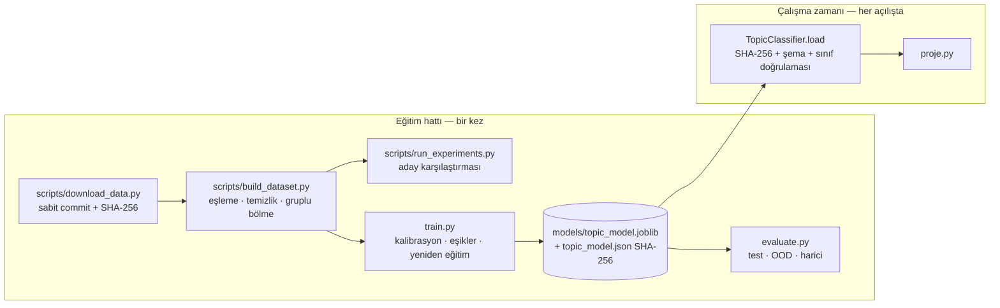
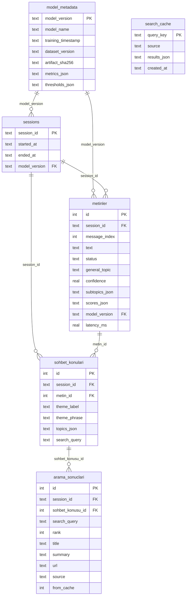

# Mimari

## Genel akış

```mermaid
flowchart TD
    U[Kullanıcı girdisi<br/>proje.py] --> P[Ön işleme<br/>src/preprocessing/text.py]
    P -->|anlamlı içerik yok| E[Uyarı: sınıflandırılmadı]
    P --> C[NLP sınıflandırıcı<br/>F5 word + char TF-IDF → LinearSVC<br/>temperature scaling]
    C --> H[Hiyerarşi<br/>genel = Σ alt konu olasılığı]
    H --> G[Genel konu + güven<br/>Belirsiz / Diğer kararı]
    H --> S[Alt konu(lar)]
    G --> T[Sohbet takibi<br/>skor = eski·0,7 + p]
    S --> T
    T --> TH[Tema birleştirici<br/>rol tabanlı: ortam / niteleyici / alan]
    TH --> Q[Sorgu üretici<br/>tema + model ağırlıklı anahtar sözcükler]
    Q --> CA{SQLite önbellek<br/>24 sa TTL}
    CA -->|isabet| R[Sonuçlar]
    CA -->|ıska| W[Web arama<br/>Wikipedia → DuckDuckGo<br/>timeout · retry · devre kesici]
    W --> R
    G --> DB[(SQLite<br/>metinler · sohbet_konulari ·<br/>arama_sonuclari · sessions ·<br/>model_metadata · search_cache)]
    TH --> DB
    R --> DB
    R --> O[Konsol çıktısı]
```

## Eğitim / çıkarım ayrımı



Program açıldığında veri okunmaz ve model eğitilmez; artifact yoksa ya da doğrulanamazsa
anlamlı bir hata ve üretim komutları gösterilir (çıkış kodu 2).

## Modüller

| Modül | Sorumluluk |
|---|---|
| `src/config.py` | Tüm sabitler (seed, yollar, eşik varsayılanları, decay, web ayarları) |
| `src/logging_setup.py` | Konsol (varsayılan ERROR/WARNING) + `logs/app.log` (INFO) |
| `src/preprocessing/text.py` | Türkçe küçük harf, NFC, mojibake onarımı, HTML/URL/mention/emoji, F5 kök, stopword |
| `src/data/sources.py` | Kaynak kayıtları, indirme (retry), SHA-256 doğrulama, provenance |
| `src/data/build.py` | Kart yükleme, taksonomi eşleme, tekilleştirme, terim-gruplu bölme, OOD/harici set, sızıntı raporu |
| `src/models/taxonomy.py` | Kategori → (genel, alt) eşleme, kuantum terim kuralı, hiyerarşi doğrulama |
| `src/models/pipeline.py` | Aday model fabrikası (E01–E11), kalibrasyonlu model kurucu |
| `src/models/calibration.py` | `TemperatureScaledClassifier` (grup-OOF sıcaklık) |
| `src/models/training.py` | Final eğitim: kalibrasyon seçimi, eşikler, kısa girdi sıcaklığı, metadata |
| `src/models/artifact.py` | Atomik kaydetme, SHA-256 doğrulamalı yükleme |
| `src/models/predictor.py` | `TopicClassifier`: tahmin, hiyerarşik birleştirme, karar, anahtar sözcük |
| `src/evaluation/metrics.py` | Sınıflandırma metrikleri, ECE, reliability, multi-label küme metrikleri |
| `src/services/conversation.py` | Decay'li skor takibi, tema, rol tabanlı ifade üretimi |
| `src/services/query_builder.py` | Arama sorgusu (dolgu temizliği, fiil filtresi, hal eki kırpma) |
| `src/services/web_search.py` | Wikipedia/DuckDuckGo istemcisi, ayrıştırıcılar, URL doğrulama |
| `src/database/db.py` | SQLite şema/migration, CRUD, önbellek |
| `src/services/app.py` | `ChatService`: katmanları birleştirir, hataları izole eder |
| `proje.py` | Konsol arayüzü ve komutlar |

## Katman bağımsızlığı ve hata yönetimi

* Web katmanı istisna fırlatmaz; `SearchOutcome.status ∈ {ok, empty, offline, error}` döner.
  Bağlantı yoksa 120 sn devre kesici (her mesajda ~6 sn beklemeyi önler).
* DB hataları `DatabaseError` olarak yakalanır; sınıflandırma, sohbet takibi ve ekran çıktısı
  sürer, kullanıcıya "kaydedilemedi" uyarısı verilir. DB açılamazsa uygulama kayıtsız çalışır.
* Boş/anlamsız girdi, EOF, Ctrl+C, 5.000 karakteri aşan girdi, bozuk/eksik model artifact'ı,
  bozuk veri dosyası, eksik JSON alanı, SHA uyuşmazlığı ayrı ayrı ele alınır
  (FINAL_REPORT §21 test listesi).

## Veritabanı şeması (v1, `PRAGMA user_version = 1`)



İndeksler: `metinler(session_id, message_index)`, `sohbet_konulari(session_id)`,
`arama_sonuclari(session_id)`, `arama_sonuclari(search_query)`, `search_cache(created_at)`.
Her tahmin, üreten model sürümüyle (`metinler.model_version` → `model_metadata`) ilişkilidir.
